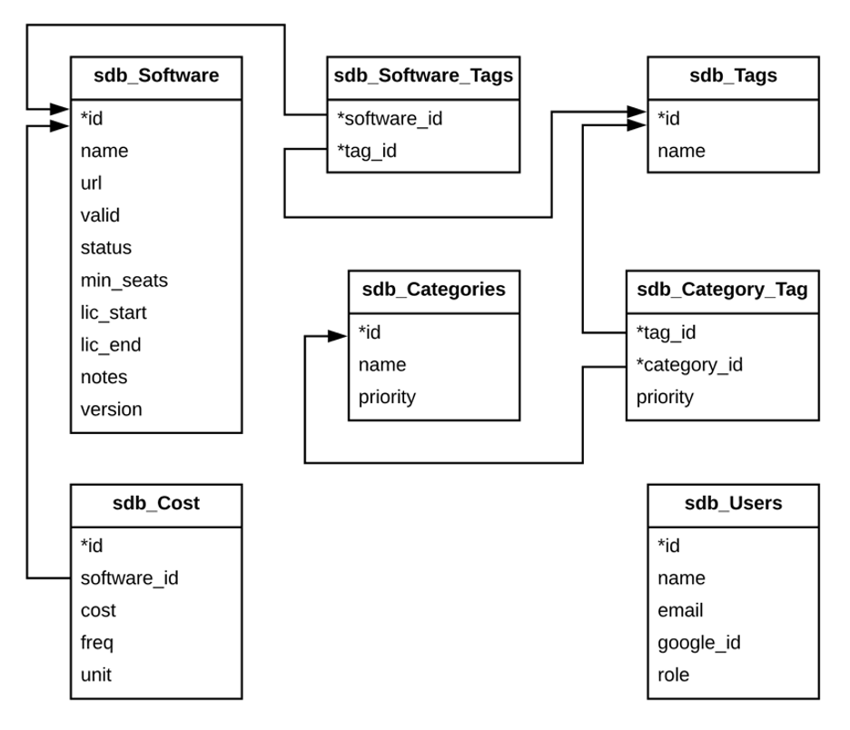

# Software Database
 
## Summary
The software database was built to hold all details of software purchased for the Design Hub. It includes a front end parameterized search that allows the user to filter results by certain parameters. In addition, it includes an administrative system where the user can make changes to records, add users and records, and/or update categories as needed.

## File Structure
The files are stored in the Design Hub Power Server, inside public_html. The internal file structure and general purpose of each file is as follows:

- /software_db
	- /components
		- close-actions.php			// close connection to DB
		- connection.php			    // open connection to DB
		- footer.php				    // footer content
		- header.php				    // header content
		- init-actions.php			// vars & others at start of every page
	- /css
		- styles.css				    // site styles
	- /google-sign-in-2.2.3				// google sign in library
	- /images					// imagery used on front end
	- /js						// front end JS
		- edit-actions.php			// used to create/remove cost features
	- auth.php					// user authentication request page
	- edit-categories.php				// edit categories page
	- edit-tags.php					// edit tags page
	- edit.php					// edit individual record page
	- login.php					// login user page
	- logout.php					// logout user page
	- search.php					// main page to view & search records
	- view-users.php				// view all users, and add more
	- view.php					// view list of records from admin side

## Database Structure
The table structure, fields and keys are listed in the diagram below. Primary keys are marked with an asterisk (*).

The database itself is stored on the Power server through the design hub. If it is moved, the login information will need to be updated inside *connection.php*.

## Components
### Google Authentication
This application uses Google Sign-In for Websites to manage authentication and verification for logged in users:
https://developers.google.com/identity/sign-in/web/backend-auth

The Google API client library for PHP has been loaded into the project.

When API changes need to be made, this can be done in the central location inside init-actions.php.

### UI Libraries
This project also uses the following libraries for the UI:

- Bootstrap - both CSS and JS
- jQuery (required by Bootstrap)
- Google Fonts - Roboto
- FontAwesome

## Usage & How-To
### User Levels
There are two user levels inside the software database - Admin and Editor. Editor users cannot add or delete users; add, edit or delete categories and tags; or delete software records. In addition, if an editor creates a new record or edits an existing one, it will be automatically marked as “Not Valid” for administrative purposes, so that the admin can go in and review and approve before marking it valid so it appears on the user search front end.

Admin users have all capabilities and no restrictions.

### Categories & Tags
Categories and tags are organizational units used to organize the software records. All categories and tags appear as sorting options on the user search front end.

Categories are the overarching groups - e.g. “Used For”, “License Type”, “Grant Funded”, etc. Tags are applied to an individual category - for example, inside “Used For” there are tags such as “Design”, “3D”, “Video”, etc.

These categories and tags can be edited by the admin. To edit these, login and go to edit a record. When you scroll down to the categories and tags section, you will see options to “Edit Categories” and “Edit Tags”.

### Priority
Categories and tags also have a priority value - a numerical value attached to each item. This value controls where that category or tag appears in the list on the parameterized search. Lower values appear closer to the top.